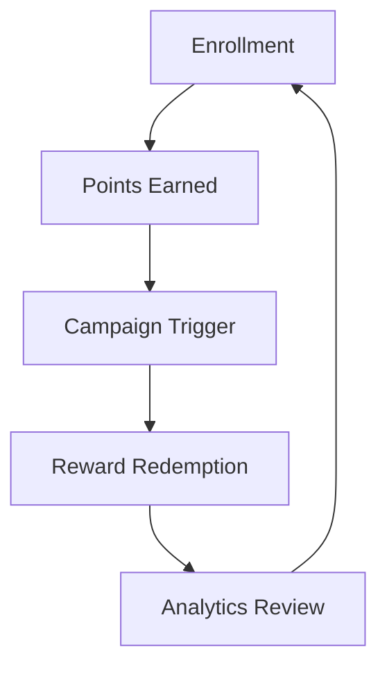

## Overview

Shopopx provides a comprehensive suite of tools to power your membership programs. You can handle everything from member onboarding to campaign automation and performance tracking in one platform. Designed for retail and restaurant brands, these features integrate seamlessly with your existing systems.

<Callout kind="info">
Shopopx connects in-store and online experiences, ensuring a unified loyalty journey for your customers.
</Callout>

## Key Features

Discover the core capabilities at a glance.

<Columns cols={2}>
  <Card title="Enrollment & Member Management" icon="users" href="#enrollment">
    Streamline onboarding and maintain detailed member profiles.
  </Card>
  <Card title="Rewards & Points Tracking" icon="award" href="#rewards">
    Manage points, tiers, and redemptions effortlessly.
  </Card>
  <Card title="Automated Marketing Campaigns" icon="mail" href="#campaigns">
    Launch targeted campaigns across multiple channels.
  </Card>
  <Card title="Analytics & Reporting" icon="bar-chart-3" href="#analytics">
    Gain insights with customizable dashboards.
  </Card>
</Columns>

## Enrollment and Member Management

Enrollment is the foundation of your loyalty program. Use Shopopx to capture member details at point-of-sale, online, or via mobile app.

### Enrollment Workflow

<Steps>
  <Step title="Collect Customer Data" icon="user-plus">
    Gather name, email, and phone during signup.

````bash
curl -X POST https://api.example.com/v1/members \
  -H "Authorization: Bearer YOUR_API_KEY" \
  -H "Content-Type: application/json" \
  -d '{
    "email": "customer@example.com",
    "name": "Jane Doe",
    "phone": "+1234567890"
  }'
````
  </Step>
  <Step title="Verify and Activate" icon="check-circle">
    Send welcome email and activate the account.
  </Step>
  <Step title="Sync with POS" icon="link">
    Integrate with your retail systems for real-time updates.
  </Step>
</Steps>

<ParamField path="members" param-type="POST" required="true">
  Endpoint for creating new members.
</ParamField>

<ParamField query="source" param-type="string" required="false">
  Origin of enrollment: `pos`, `web`, `app`.
</ParamField>

## Rewards and Points Tracking

Track points accrual, tiers, and redemptions automatically.

<CodeGroup tabs="JavaScript,Python">
````javascript
// Award points after purchase
const response = await fetch('https://api.example.com/v1/points/award', {
  method: 'POST',
  headers: {
    'Authorization': 'Bearer YOUR_API_KEY',
    'Content-Type': 'application/json'
  },
  body: JSON.stringify({
    memberId: 'mem_123',
    points: 150,
    reason: 'purchase'
  })
});
````

````python
import requests

response = requests.post(
  'https://api.example.com/v1/points/award',
  headers={
    'Authorization': 'Bearer YOUR_API_KEY',
    'Content-Type': 'application/json'
  },
  json={
    'memberId': 'mem_123',
    'points': 150,
    'reason': 'purchase'
  }
)
````
</CodeGroup>

## Automated Marketing Campaigns

Automate personalized campaigns based on member behavior.

<Tabs>
  <Tab title="Email" icon="mail">
    Target members with abandoned cart reminders.

    <Request tabs="cURL,JavaScript">
````bash
curl -X POST https://api.example.com/v1/campaigns/email \
  -H "Authorization: Bearer YOUR_API_KEY" \
  -d '{
    "template": "abandoned-cart",
    "members": ["mem_123", "mem_456"]
  }'
````

````javascript
await fetch('https://api.example.com/v1/campaigns/email', {
  method: 'POST',
  headers: { 'Authorization': 'Bearer YOUR_API_KEY' },
  body: JSON.stringify({
    template: 'abandoned-cart',
    members: ['mem_123']
  })
});
````
    </Request>
  </Tab>
  <Tab title="SMS" icon="message-circle">
    Send flash sale alerts to opted-in members.
  </Tab>
  <Tab title="Push Notifications" icon="bell">
    Engage app users with time-sensitive offers.
  </Tab>
</Tabs>

## Analytics and Reporting Dashboards

Monitor program health with real-time dashboards.

<Expandable title="Advanced Analytics Setup" default-open="false">

Configure custom reports for retention rates and ROI.

```javascript
// Fetch dashboard data
const metrics = await fetch('https://api.example.com/v1/analytics/overview', {
  headers: { 'Authorization': 'Bearer YOUR_API_KEY' }
}).then(res => res.json());

console.log(metrics.redemptions); // e.g., { total: 5423, avg: 12.5 }
```

</Expandable>

<Callout kind="tip">
Review dashboards weekly to optimize your campaigns. Focus on metrics like redemption rate `{>20%}` for success.
</Callout>

## Member Journey Flow



These features work together to drive repeat business and customer loyalty. Customize them to fit your brand's needs.