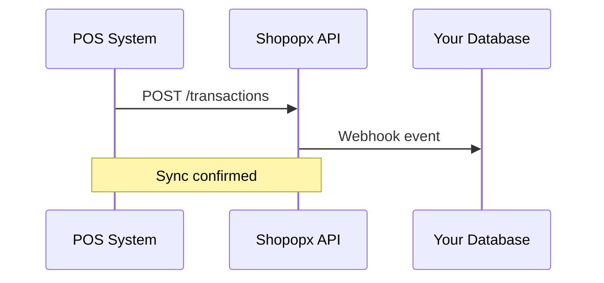

## Overview

Shopopx integrates seamlessly with your POS systems, e-commerce platforms, and custom applications to unify customer data, loyalty programs, and marketing efforts. You gain real-time synchronization of sales, memberships, and rewards across in-store and online channels.

Use the dashboard at `https://dashboard.example.com` to manage connections. Start with pre-built integrations for popular tools, then configure webhooks or custom APIs for advanced needs.

<Callout kind="tip">
Review your system's API documentation before setup. Test connections in sandbox mode to avoid disrupting live operations.
</Callout>

## Key Integration Options

<Columns cols={2}>
  <Card title="POS Synchronization" icon="shopping-cart" href="#pos-sync">
    Sync sales and customer data from POS systems like Square or Lightspeed.
  </Card>
  <Card title="E-commerce Linking" icon="shopping-bag" href="#ecommerce">
    Connect Shopify, WooCommerce, or BigCommerce for unified loyalty tracking.
  </Card>
  <Card title="Webhooks" icon="zap" href="#webhooks">
    Receive real-time updates on events like new memberships or reward redemptions.
  </Card>
  <Card title="Custom APIs" icon="code" href="#custom-api">
    Build tailored integrations using Shopopx REST APIs.
  </Card>
</Columns>

## POS System Synchronization

Connect your POS to Shopopx for automatic member recognition and reward application at checkout.

<Steps>
  <Step title="Enable API Access" icon="settings">
    In your POS admin panel, generate an API key and note the webhook endpoint.
  </Step>
  <Step title="Add to Shopopx Dashboard">
    Navigate to Integrations > POS in `https://dashboard.example.com/integrations`.
    
    Enter your POS API key and select sync fields: customers, transactions, inventory.
  </Step>
  <Step title="Test Connection">
    Process a test sale. Verify data appears in Shopopx within `<30s`.
  </Step>
  <Step title="Go Live">
    Toggle production mode and monitor the first 100 transactions.
  </Step>
</Steps>

<Callout kind="alert">
POS sync processes up to `1000` transactions per hour. Contact support for higher volumes.
</Callout>

## E-commerce Platform Linking

Link your online store to track cross-channel loyalty points.

<Tabs>
  <Tab title="Shopify" icon="shopping-bag">
    <Steps>
      <Step title="Install App">
        Search for "Shopopx" in Shopify App Store and install.
      </Step>
      <Step title="Authorize">
        Grant permissions for orders, customers, and products.
      </Step>
    </Steps>
    
````javascript
// Example webhook payload from Shopify
{
  "order": {
    "id": 123456789,
    "customer": { "email": "user@example.com" },
    "total_price": "99.99"
  }
}
````
  </Tab>
  <Tab title="WooCommerce" icon="wordpress">
    Use the Shopopx plugin from WordPress dashboard.
    
    Configure REST API keys with read/write access to orders and users.
    
````bash
# Install plugin
wp plugin install shopopx --activate
````
  </Tab>
</Tabs>

## Webhook Configuration

Set up webhooks to push events from Shopopx to your systems in real time.

1. Go to `https://dashboard.example.com/webhooks`.
2. Add a new webhook URL: `https://your-webhook-url.com/shopopx`.
3. Select events: `member.created`, `reward.redeemed`, `transaction.sync`.

<CodeGroup tabs="Node.js,Python">
````javascript
// Node.js webhook handler
const express = require('express');
const app = express();
app.use(express.json());

app.post('/shopopx', (req, res) => {
  const event = req.body.event;
  if (event === 'member.created') {
    console.log(`New member: ${req.body.data.email}`);
  }
  res.status(200).json({ received: true });
});
````
````python
# Python webhook handler (Flask)
from flask import Flask, request, jsonify
app = Flask(__name__)

@app.route('/shopopx', methods=['POST'])
def shopopx_webhook():
    event = request.json['event']
    if event == 'member.created':
        print(f"New member: {request.json['data']['email']}")
    return jsonify({'received': True})
````
</CodeGroup>

Verify with the test button in the dashboard.

## Custom API Integration

For bespoke needs, use Shopopx REST APIs at `https://api.example.com/v1`.

<ParamField path="members" param-type="GET" required="true">
  Retrieve member list with filters.
</ParamField>

<ParamField header="Authorization" param-type="string" required="true">
  Bearer `{YOUR_API_KEY}`.
</ParamField>

<Request tabs="cURL,JavaScript">
````bash
curl -X GET https://api.example.com/v1/members \
  -H "Authorization: Bearer YOUR_API_KEY" \
  -H "Content-Type: application/json"
````
````javascript
const response = await fetch('https://api.example.com/v1/members', {
  headers: {
    'Authorization': 'Bearer YOUR_API_KEY',
    'Content-Type': 'application/json'
  }
});
const members = await response.json();
````
</Request>

<Response tabs="200">
````json
{
  "members": [
    {
      "id": "mem_123",
      "email": "user@example.com",
      "points": 1500,
      "status": "active"
    }
  ],
  "total": 1
}
````
</Response>



<Expandable title="Advanced Topics" default-open="false">
Explore OAuth 2.0 for user-impersonated flows or batch endpoints for high-volume data.
</Expandable>